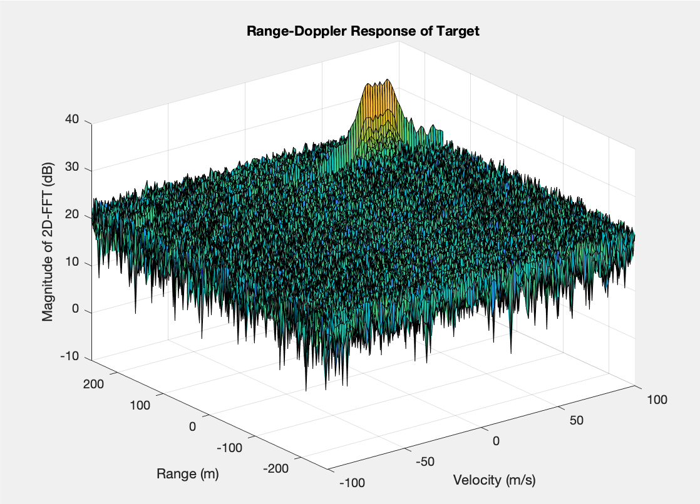
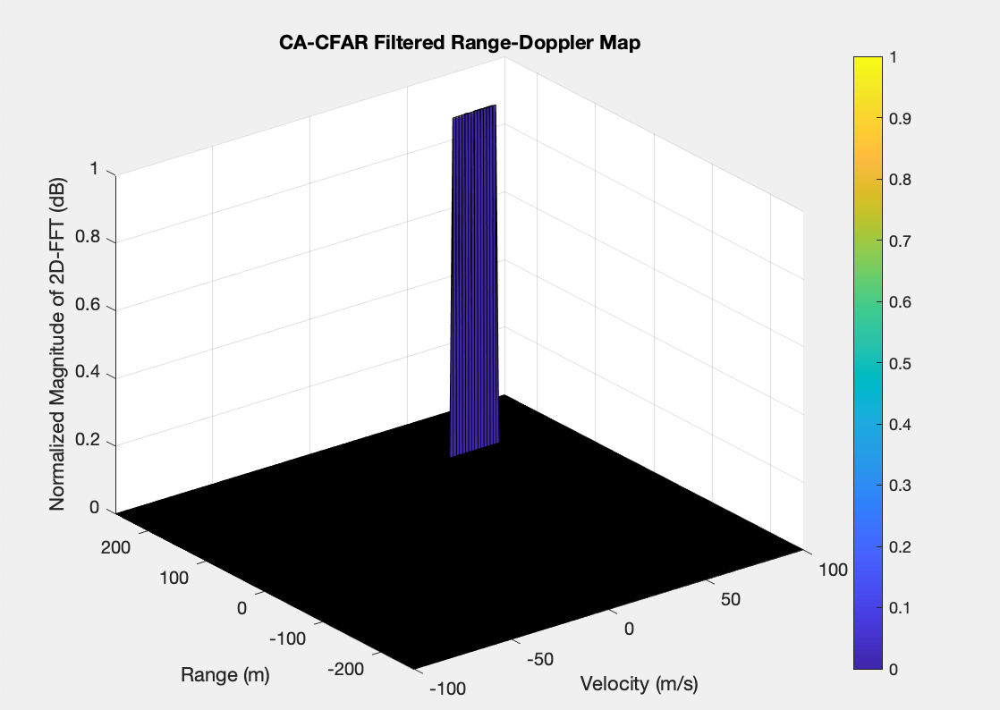
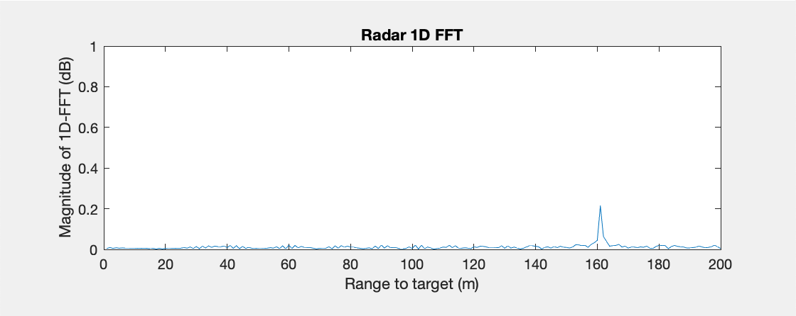

# Radar Target Generation and Detection

<table border=0 width="600px" align="center">
	<tbody> 
    <tr>		
            <td width="20%" align="center"> ONE </td>
			<td width="20%" align="center"> TWO </td>
		</tr>
		<tr>
			<td width="20%" align="center">  </td>
			<td width="20%" align="center">  </td>
		</tr>
	</tbody>
</table>
